

  <strong><a href="README.md">Türkçe</a></strong>

# Dispatch

  <picture>
    <source media="(prefers-color-scheme: dark)" srcset="dispatch/images/brand/dispatch.png">
    
  </picture>

  <strong>Next-generation minimalist email experience powered by AI assistance, instant email translation, sender approval queues, and spy tracker shield security.</strong>

[Website](https://dispatch.noirlang.tr)

## Setup Wizard

> The visual Setup Wizard that greets you on first launch walks you through the server, IMAP/SMTP account, and security settings in a few simple steps — no technical knowledge required. Dispatch is ready to use within minutes.

  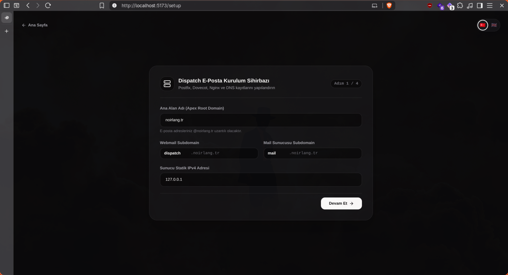
  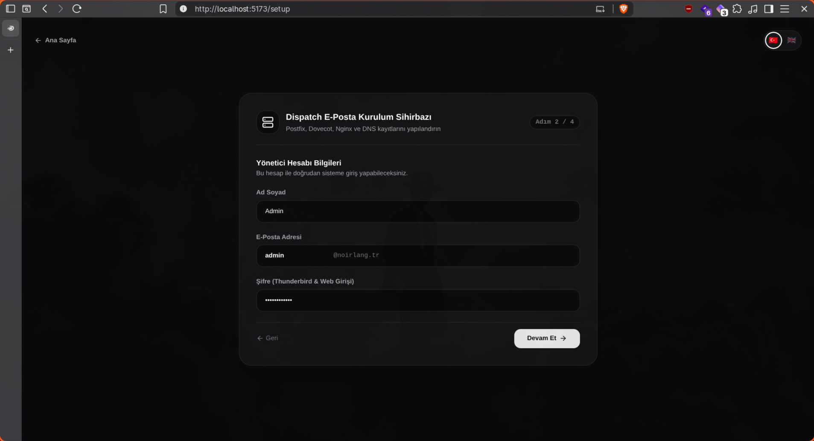
  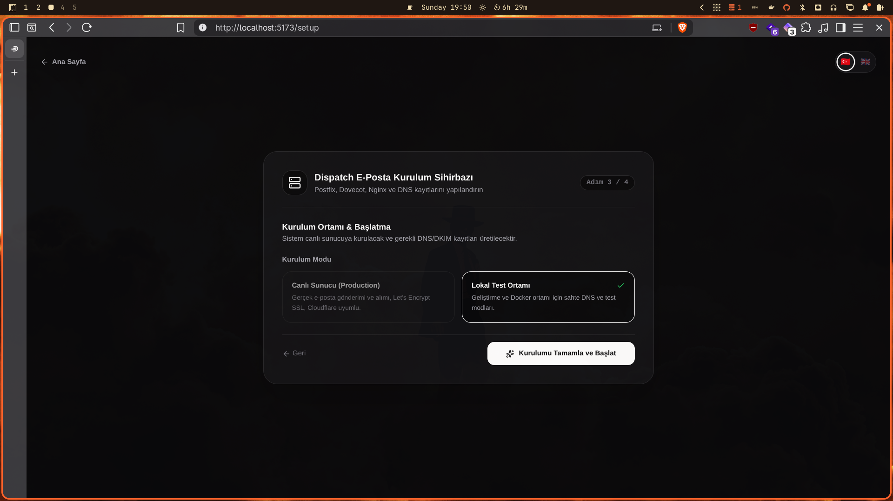

---

## Features

---

### 1. Sender Approval Queue, AI Dashboard & Calendar Integration
> First-time incoming senders are safely routed to an Approvals queue with 1-click Approve or Block actions. Key details like meetings, tracking codes, and deadlines are automatically detected by AI, converted into Dashboard cards, and synced to the Calendar.

[▶️ **Watch Demo Video** (`dispatch-onay-ai-pano-takvim.mp4`)](https://dispatch.noirlang.tr/videos/dispatch-onay-ai-pano-takvim.mp4)

---

### 2. AI Email Summarization & Smart Reply Engine
> Long and complex emails are summarized into concise 2-3 bullet points within seconds using Google Gemini, Claude, or OpenAI models; contextual and intelligent response drafts can be generated with a single click.

[▶️ **Watch Demo Video** (`dispatch-aiozet-aiyanit.mp4`)](https://dispatch.noirlang.tr/videos/dispatch-aiozet-aiyanit.mp4)

---

### 3. AI-Powered Multi-Language Email Translation
> Foreign language emails are instantly translated into English, Turkish, or other target languages directly inside the reader while preserving layout, typography, and original tone.

[▶️ **Watch Demo Video** (`dispatch-ai-ceviri.mp4`)](https://dispatch.noirlang.tr/videos/dispatch-ai-ceviri.mp4)

---

### 4. Email Management, Contact Groups & Smart Aliases
> Manage Inbox, Sent, and Draft folders with full search; broadcast messages to saved contact groups using `@group_name` syntax (e.g. `@team`) with automatic member resolution and simultaneous delivery.

[▶️ **Watch Demo Video** (`dispatch-mail-grup.mp4`)](https://dispatch.noirlang.tr/videos/dispatch-mail-grup.mp4)

---

### 5. Integrated RSS Feed Reader & Background Sync
> Subscribe to favorite tech blogs, news sites, and developer feeds; scheduled Sidekiq background workers fetch and synchronize updates periodically without leaving the email experience.

[▶️ **Watch Demo Video** (`dispatch-akis-rss.mp4`)](https://dispatch.noirlang.tr/videos/dispatch-akis-rss.mp4)

---

### 6. Rich Markdown Formatting Support
> Full GitHub Flavored Markdown (GFM) support when composing and replying to emails; craft clean emails with headers, code blocks, syntax highlighting, lists, tables, and styled blockquotes.

[▶️ **Watch Demo Video** (`dispatch-markdown.mp4`)](https://dispatch.noirlang.tr/videos/dispatch-markdown.mp4)

---

### 7. Email-Powered Blogging Engine
> Publish articles to the built-in public blog (`/@username/slug`) simply by emailing `blog@yourdomain.com`. Authors can instantly unpublish or delete articles by sending an email with `Rm: <Blog Title>` or `rm: <slug>`.

[▶️ **Watch Demo Video** (`dispatch-blog.mp4`)](https://dispatch.noirlang.tr/videos/dispatch-blog.mp4)

---

### 8. Registration & Access Modes
> Three different access modes are available: registration with an invite code, account creation only through the admin panel, or open registration for everyone. Depending on the server policy, the administrator can switch between modes with a single click — you decide exactly who can join.

  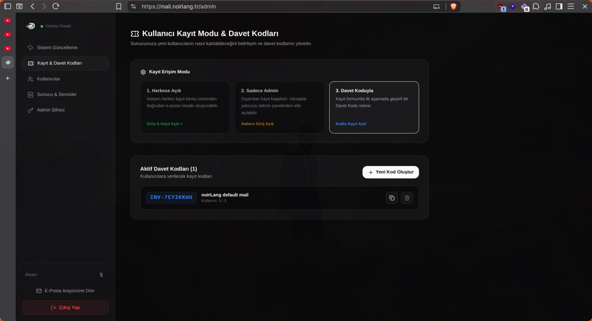

---

### 9. Mobile-Friendly Interface
> Mail, Dashboard, Calendar, Feed, and Settings — fully responsive, minimal, and fast on phones and tablets.

  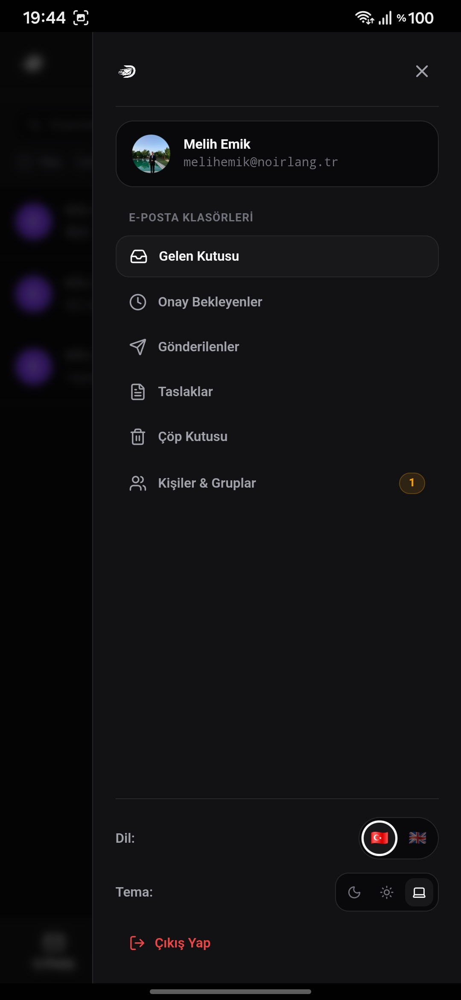
  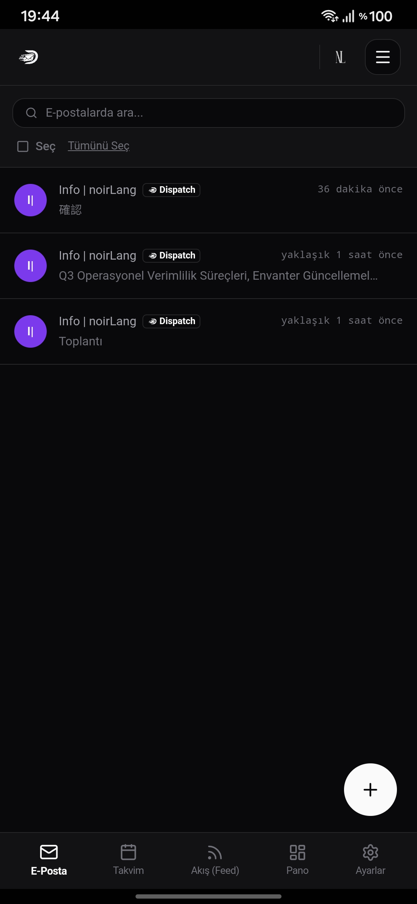
  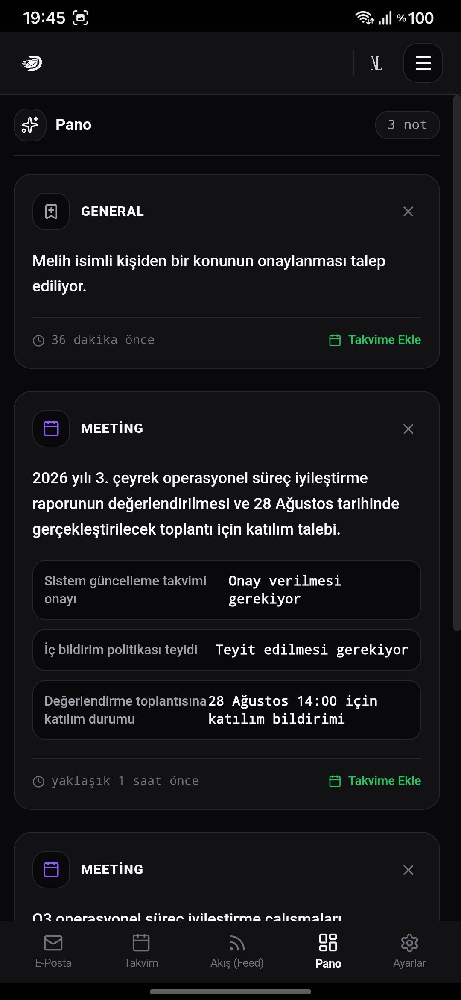
  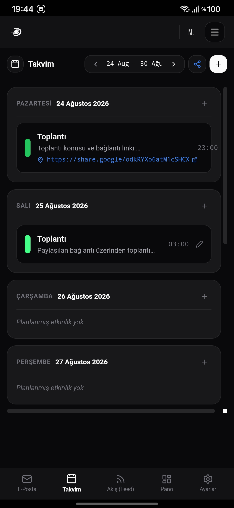
  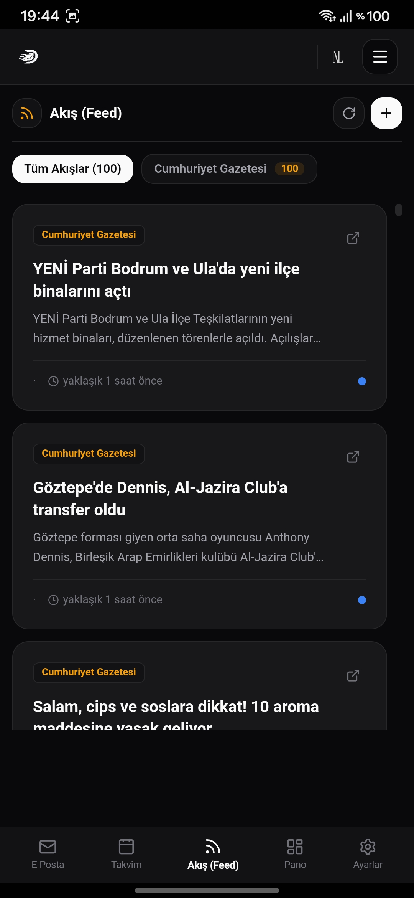
  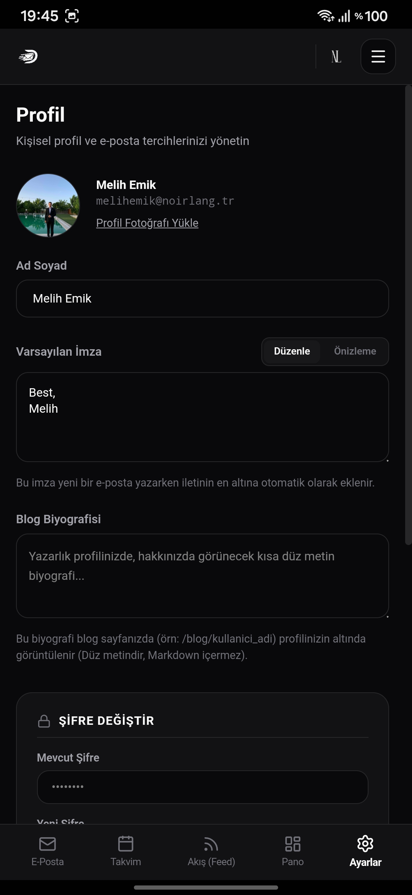
  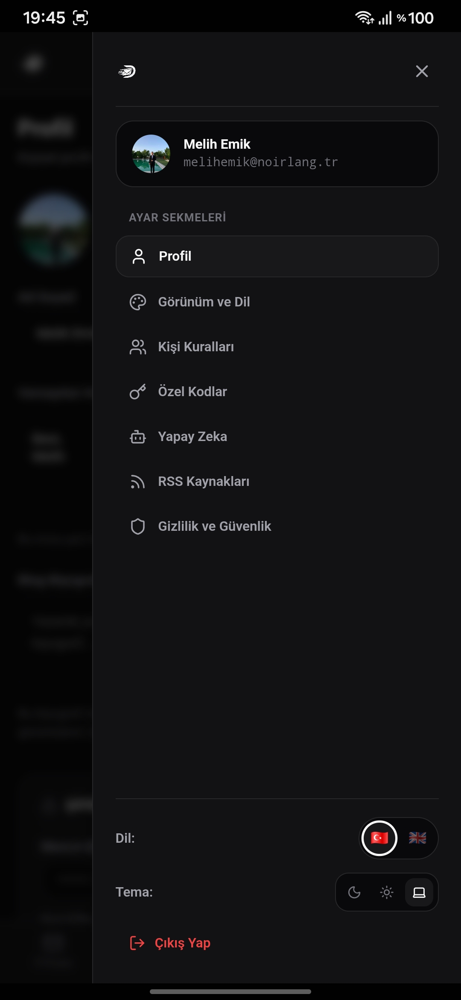

---

  <picture>
    <source media="(prefers-color-scheme: dark)" srcset="dispatch/images/brand/sirket.png">
    
  </picture>

